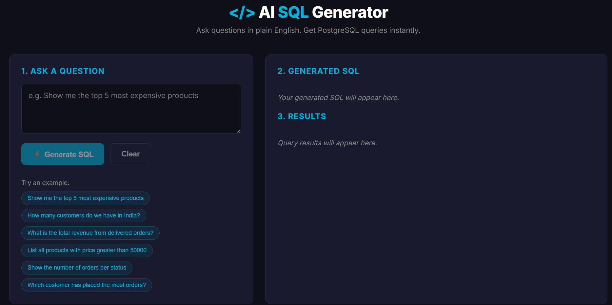
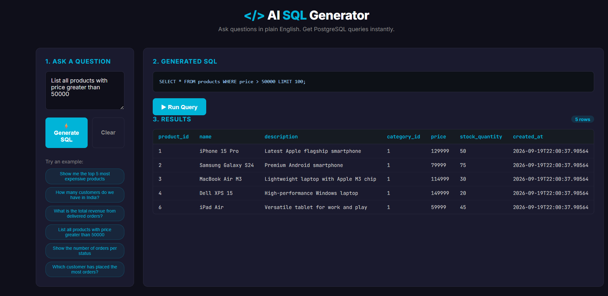

# AI SQL Query Generator

> Convert natural language questions into executable PostgreSQL queries using AI.

[](https://dotnet.microsoft.com)
[](https://angular.io)
[](https://www.postgresql.org)
[](LICENSE)

A full-stack AI-powered tool that lets you query a PostgreSQL database in plain English. Type a question, watch the AI generate SQL, run it, and see the results — all in a clean, modern UI.

---

## 📸 Screenshots

| Home & Query Input | Generated SQL & Results |
|---------------------|-------------------------|
|  |  |

---

## ✨ Features

- 🗣️ **Natural Language Input** — Ask questions like _"Show me the top 5 most expensive products"_
- 🤖 **AI-Powered SQL Generation** — Uses Groq's blazing-fast LLMs (OpenAI-compatible API)
- 🛡️ **Query Safety Layer** — Only `SELECT`/`WITH` statements are allowed; all DDL/DML is blocked
- 📊 **Live Results Table** — Instant rendering of query results
- 🕓 **Query Examples** — One-click sample prompts to get started
- 🎯 **Schema-Aware** — The AI sees your database structure and generates accurate SQL
- 🌙 **Modern Dark UI** — Clean, responsive design with Angular signals
- 🔒 **Secret Management** — Uses .NET User Secrets (no credentials in source control)

---

## 🏗️ Architecture

```
┌─────────────┐      ┌──────────────────┐      ┌─────────────┐
│             │      │                  │      │             │
│  Angular    │─────▶│  .NET 10 Web API │─────▶│  Groq LLM   │
│  Frontend   │◀─────│                  │◀─────│  (AI)       │
│             │      │                  │      │             │
└─────────────┘      └────────┬─────────┘      └─────────────┘
                              │
                              │ SQL Execution
                              ▼
                     ┌──────────────────┐
                     │                  │
                     │   PostgreSQL     │
                     │  (Local / Neon)  │
                     │                  │
                     └──────────────────┘
```

**Flow:**
1. User types a natural language question in the Angular UI
2. Frontend sends the question to the .NET API
3. API fetches the DB schema + sends a prompt to Groq
4. Groq returns a PostgreSQL `SELECT` query
5. User clicks "Run Query" → API executes it against PostgreSQL
6. Results are returned as JSON and rendered in a table

---

## 🛠️ Tech Stack

| Layer | Technology | Version |
|-------|-----------|---------|
| **Backend** | .NET Core Web API | 10 |
| **Frontend** | Angular (Standalone + Signals) | 22 |
| **Database** | PostgreSQL | 16+ |
| **AI Provider** | Groq (OpenAI-compatible API) | `openai/gpt-oss-120b` |
| **ORM** | Entity Framework Core + Npgsql | 9 |
| **DB Driver** | Npgsql | Latest |

---

## 📁 Project Structure

```
ai-sql-generator/
├── backend/
│   └── AiSqlGenerator.Api/
│       ├── Controllers/
│       │   └── QueryController.cs
│       ├── Data/
│       │   └── AppDbContext.cs
│       ├── Models/
│       │   ├── Entities.cs
│       │   └── Dtos.cs
│       ├── Services/
│       │   ├── SchemaProvider.cs
│       │   ├── QueryGeneratorService.cs
│       │   └── SqlExecutionService.cs
│       ├── Program.cs
│       └── appsettings.json
├── frontend/
│   └── ai-sql-generator-ui/
│       └── src/
│           └── app/
│               ├── query-generator/
│               │   ├── query-generator.ts
│               │   ├── query-generator.html
│               │   └── query-generator.css
│               ├── query.service.ts
│               ├── app.ts
│               └── app.config.ts
├── database/
│   ├── 01_schema.sql
│   └── 02_sample_data.sql
├── docs/
│   └── screenshots/
├── .gitignore
├── LICENSE
└── README.md
```

---

## 🚀 Getting Started

### Prerequisites

- [.NET 10 SDK](https://dotnet.microsoft.com/download/dotnet/10.0)
- [Node.js 22.12+](https://nodejs.org)
- [Angular CLI 22+](https://angular.io/cli) (`npm install -g @angular/cli@latest`)
- [PostgreSQL 16+](https://www.postgresql.org/download/) — or a free [Neon](https://neon.tech) account
- [Groq API Key](https://console.groq.com) — free, no credit card required

---

### 1️⃣ Database Setup

**Option A: Local PostgreSQL**

```bash
# Create database
psql -U postgres -c "CREATE DATABASE ai_sql_demo;"

# Load schema and sample data
psql -U postgres -d ai_sql_demo -f database/01_schema.sql
psql -U postgres -d ai_sql_demo -f database/02_sample_data.sql
```

**Option B: Neon (Free Cloud PostgreSQL)**

1. Sign up at [neon.tech](https://neon.tech) and create a project
2. Copy the connection string from the dashboard
3. Convert the URI to Npgsql format (see below)
4. Run `01_schema.sql` and `02_sample_data.sql` via Neon's SQL Editor

---

### 2️⃣ Backend Setup

```bash
cd backend/AiSqlGenerator.Api
dotnet restore
dotnet user-secrets init
```

**Configure secrets (never commit these):**

```bash
# Groq AI
dotnet user-secrets set "Groq:ApiKey" "gsk_your_actual_key"
dotnet user-secrets set "Groq:Model" "openai/gpt-oss-120b"

# PostgreSQL connection (local)
dotnet user-secrets set "ConnectionStrings:DefaultConnection" \
  "Host=localhost;Port=5432;Database=ai_sql_demo;Username=postgres;Password=yourpassword"

# OR PostgreSQL connection (Neon)
dotnet user-secrets set "ConnectionStrings:DefaultConnection" \
  "Host=ep-xyz-123.aws.neon.tech;Port=5432;Database=neondb;Username=neondb_owner;Password=yourpassword;SSL Mode=Require;Trust Server Certificate=true"
```

**Run the API:**

```bash
dotnet run --launch-profile https
```

API will be available at `https://localhost:7249`
Swagger UI: `https://localhost:7249/swagger`

---

### 3️⃣ Frontend Setup

```bash
cd frontend/ai-sql-generator-ui
npm install
```

**Update the API URL** in `src/app/query.service.ts`:

```typescript
private readonly apiBase = 'https://localhost:7249/api/query';
```

**Run the dev server:**

```bash
ng serve --open
```

Frontend: `http://localhost:4200`

---

## 🔌 API Reference

### `POST /api/query/generate`

Converts a natural language question into a PostgreSQL query.

**Request:**
```json
{
  "query": "Show me the top 5 most expensive products"
}
```

**Response:**
```json
{
  "sql": "SELECT name, price FROM products ORDER BY price DESC LIMIT 5;",
  "error": null
}
```

---

### `POST /api/query/execute`

Executes a `SELECT` query against PostgreSQL.

**Request:**
```json
{
  "sql": "SELECT name, price FROM products ORDER BY price DESC LIMIT 5;"
}
```

**Response:**
```json
{
  "success": true,
  "data": [
    { "name": "Dell XPS 15", "price": 149999.00 },
    { "name": "iPhone 15 Pro", "price": 129999.00 }
  ],
  "columns": ["name", "price"],
  "rowCount": 5,
  "error": null
}
```

---

## 🔒 Security

| Protection | Implementation |
|------------|---------------|
| **Read-only queries** | Only `SELECT` and `WITH` statements allowed |
| **Forbidden keywords** | `INSERT`, `UPDATE`, `DELETE`, `DROP`, `ALTER`, `TRUNCATE`, `GRANT`, `REVOKE`, `EXEC` |
| **Query timeout** | 30 seconds max per query |
| **Secrets management** | .NET User Secrets (never committed) |
| **CORS** | Restricted to the Angular dev origin |
| **AI output sanitization** | Markdown fences stripped before execution |

---

## 🧪 Sample Questions to Try

| Question | What It Tests |
|----------|---------------|
| `Show me the top 5 most expensive products` | `ORDER BY` + `LIMIT` |
| `How many customers do we have in India?` | `COUNT` + `WHERE` |
| `What is the total revenue from delivered orders?` | `SUM` + `WHERE` |
| `Show the number of orders per status` | `GROUP BY` |
| `Which customer has placed the most orders?` | `JOIN` + `GROUP BY` + `ORDER BY` |
| `List all products with price greater than 50000` | Filtering |
| `Drop all tables` | Should be **blocked** ✅ |

---

## 🗄️ Database Schema

| Table | Purpose |
|-------|---------|
| `categories` | Product categories (Electronics, Books, etc.) |
| `customers` | Customer records (20 sample rows) |
| `products` | Product catalog (26 sample rows) |
| `orders` | Order headers (50 sample rows) |
| `order_items` | Line items per order (50 sample rows) |

---

## ☁️ Deployment

| Component | Recommended Service | Free Tier |
|-----------|--------------------|-----------|
| **Frontend** | Azure Static Web Apps | 500 MB, 100 GB bandwidth/month |
| **Backend** | Azure App Service (F1) | 1 GB disk, 60 min CPU/day |
| **Database** | Neon | 0.5 GB storage, auto-suspend |
| **AI** | Groq | Generous free tier |

**Production `appsettings.json`** should reference environment variables for secrets, not hard-coded values.

---

## 🧗 Challenges Solved

- **Schema case sensitivity** — PostgreSQL returns lowercase identifiers; solved by reading metadata via raw `NpgsqlDataReader` instead of EF Core mapping
- **Model deprecation** — Migrated from the retired `llama-3.3-70b-versatile` to `openai/gpt-oss-120b`
- **CORS + HTTPS dev certs** — Solved with `dotnet dev-certs https --trust` and a targeted CORS policy
- **AI hallucination of unsafe SQL** — Blocked at the execution layer with keyword filtering

---

## 🤝 Contributing

Contributions, issues, and feature requests are welcome!

1. Fork the repository
2. Create a feature branch (`git checkout -b feature/amazing-feature`)
3. Commit your changes (`git commit -m 'Add amazing feature'`)
4. Push the branch (`git push origin feature/amazing-feature`)
5. Open a Pull Request

---

## 📄 License

This project is licensed under the MIT License — see the [LICENSE](LICENSE) file for details.

---

## 👤 Author

**QueryNex**
- Portfolio: [querynexai.github.io](https://querynexai.github.io)
- GitHub: [@querynexai](https://github.com/querynexai)
- Email: querynex.ai@outlook.com

---

## ⭐ Show Your Support

If this project helped you, please give it a star ⭐ — it helps others discover it too.

---

## 🙏 Acknowledgements

- [Groq](https://groq.com) for the fast, free AI inference
- [Neon](https://neon.tech) for serverless PostgreSQL
- [Microsoft Semantic Kernel](https://github.com/microsoft/semantic-kernel) for AI orchestration inspiration
- The open-source .NET, Angular, and PostgreSQL communities